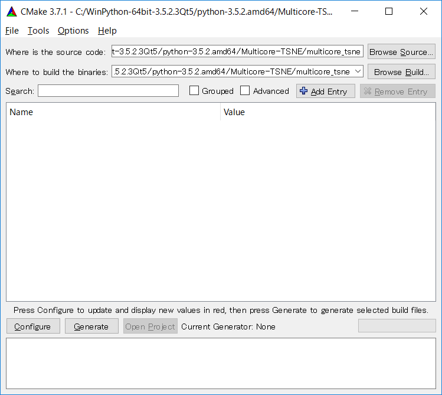

# Install MuticoreTSNE on windows
I used cmake3.7.1(cmake-gui)  (https://cmake.org/download/) for building MuticoreTSNE on windows. 
```
1. Clone or download source code. 
2. Cmake from the CMakeLists.txt(./multicore_tsne/CMakeLists.txt). 

3. Open ./multicore_tsne/Project.sln. 
4. Set configuration to Release and x64 
5. Press F7 to build.
6. The dll file is in ./multicore_tsne/Release/ after built. 
```

You move to windows directory and install it using following commands 
```
python setup.py install 
```

I tested with Anaconda4.2.0 64bit(Python 2.7.12), WinPython-64bit-2.7.10.3, WinPython-64bit-3.4.4.5Qt5 
and WinPython-64bit-3.5.2.3Qt5. In these case, I can install and run the MulticoreTSNE. 
 